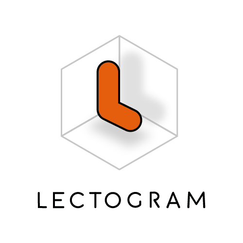

# Lectogram: Biblioteca Visual

` LECTOGRAM: sistema de apoyo a la ejecución de actividades de la vida diaria para personas con demencia `

### FONDEF ID23I10034
Lectogram es un proyecto diseñado para generar apoyos procedimentales para adultos con demencia en el hogar, facilitando la realización de sus tareas diarias mediante el uso de pictogramas.

Este repositorio contiene los archivos de:
- [Marca Lectogram](branding.md)
- [Lugares](places.md)
- [Rutinas](tasks.md)

## Estructura del repositorio
- `src/`: Contiene los archivos fuente en formato .ai (Adobe Illustrator).
  - `lectogram-branding.ai`: Logo e isotipo de marca.
  - `places.ai`: Pictogramas de lugares.
  - `tasks.ai`: Pictogramas de tareas.
- `dist/`: Contiene los archivos optimizados en formato .svg.
  - `branding/`: Pictogramas de marca optimizados (png, svg).
  - `places/`: Pictogramas de lugares optimizados.
  - `tasks/`: Pictogramas de tareas optimizados.
- `lectogram.json`: Archivo JSON con la con la biblioteca visual de lectogram (marca y pictogramas).

## Uso
Para utilizar los íconos en tu proyecto, simplemente importa los archivos SVG desde la carpeta `dist` como paquete a partir de [lectogram.json](lectogram.json).

#### Licencia

Este proyecto está bajo la licencia de copyright de la Universidad de las Américas. Ver [licencia](LICENSE.md).