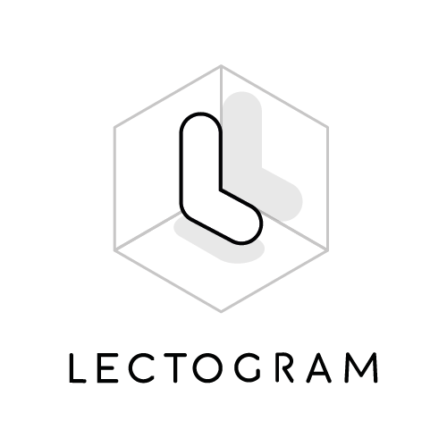
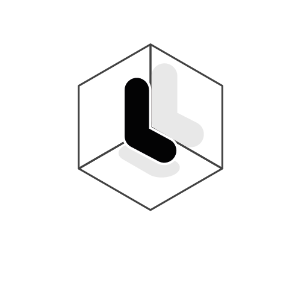
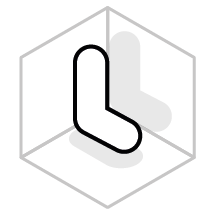
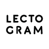

# Marca

## Isotipo + logo

<table>
<tr>
<td style="background: white">

</td>
<td style="background: black">

</td>
</tr>
</table>

## Isotipo

<table>
<tr>
<td style="background: white">

</td>
<td style="background: black">

</td>
</tr>
</table>

## Logo cuadrado

<table>
<tr>
<td style="background: white">

</td>
<td style="background: black">

</td>
</tr>
</table>

## Logo horizontal

<table>
<tr>
<td style="background: white">

</td>
</tr>
</table>