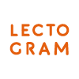
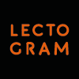
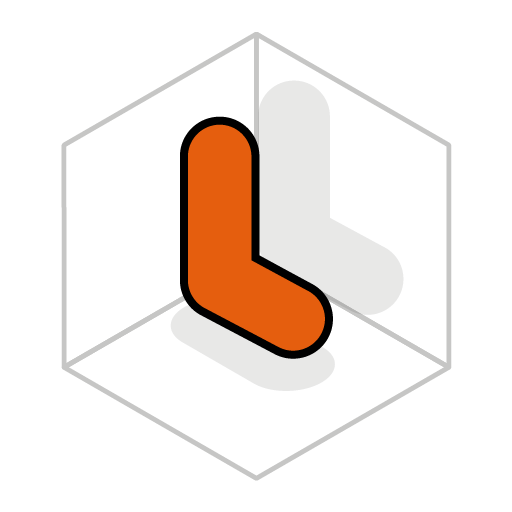

# Marca

Nota: la marca lectogram está con contraste invertido (modo oscuro - modo claro). Desafortunadamente Github desactiva los fondos blanco-negro para esta visualización.

## Isotipo + logo

<table>
<tr>
<td style="background: white">

</td>
<td style="background: black">

</td>
</tr>
</table>

## Isotipo

<table>
<tr>
<td style="background: white">

</td>
<td style="background: black">

</td>
</tr>
</table>

## Logo cuadrado

<table>
<tr>
<td style="background: white">

</td>
<td style="background: black">

</td>
</tr>
</table>

## Logo horizontal

<table>
<tr>
<td style="background: white">

</td>
</tr>
</table>

### Íconos para Alexa Store

