| pictograma | descripción | pictograma | descripción |pictograma | descripción |
|--|--|--|--|--|--|
|  | Apagar los dispositivos electrónicos |  | Apagar las luces antes de dormir |  | Apagar los dispositivos electrónicos al final del día |
| 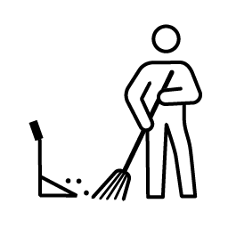 | Barrer el suelo |  | Cambiar las ampolletas |  | Cambiar las sábanas |
| 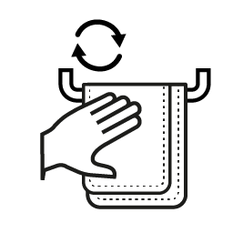 | Cambiar las toallas |  | Cepillarse los dientes | 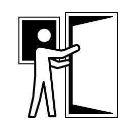 | Cerrar correctamente las puertas y ventanas |
|  | Colgar la ropa en el tendedero |  | Doblar la ropa limpia |  | Ducharse o bañarse |
|  | Guardar los objetos personales | 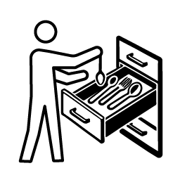 | Guardar los utensilios de cocina | 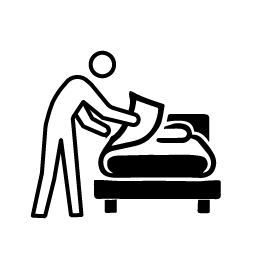 | Hacer la cama |
| 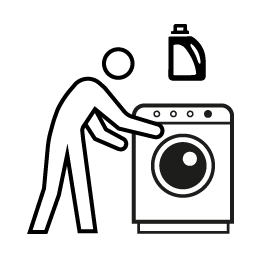 | Hacer la colada |  | Hacer una lista de tareas de jardinería |  | Lavar los platos |
| 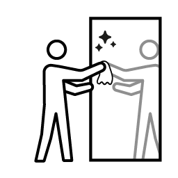 | Limpiar el espejo | 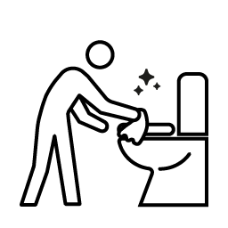 | Limpiar el inodoro | 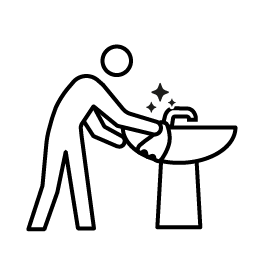 | Limpiar el lavabo |
|  | Limpiar el polvo de las superficies |  | Limpiar el polvo de los muebles | 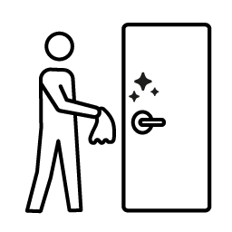 | Limpiar el pomo de las puertas |
| 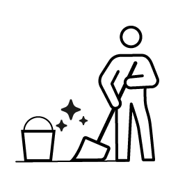 | Limpiar el suelo | 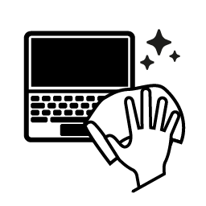 | Limpiar el teclado y la pantalla del ordenador |  | Limpiar la bañera o la ducha |
|  | Limpiar la encimera |  | Limpiar la lavadora y secadora |  | Limpiar la mesa después de comer |
|  | Limpiar las hojas caídas |  | Limpiar las superficies |  | Limpiar los contenedores de almacenamiento |
|  | Limpiar los electrodomésticos |  | Limpiar los espejos |  | Limpiar los muebles de exterior |
|  | Ordenar la mesita de noche |  | Ordenar los lápices y bolígrafos |  | Ordenar los objetos decorativos |
|  | Ordenar los productos de automóvil |  | Ordenar los productos de lavandería | 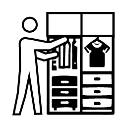 | Organizar la ropa en el armario |
|  | Organizar las herramientas | 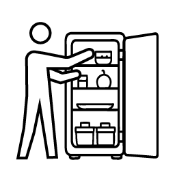 | Organizar los alimentos en el refrigerador |  | Organizar los cojines del sofá |
|  | Organizar los documentos | 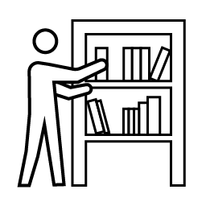 | Organizar los libros y revistas |  | Organizar los manteles y servilletas |
|  | Organizar los muebles de jardín | 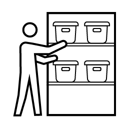 | Organizar los objetos de almacenamiento |  | Organizar los productos de higiene personal |
| 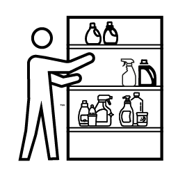 | Organizar los productos de limpieza | 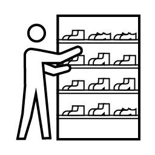 | Organizar los zapatos |  | Planificar el menú semanal |
|  | Podar las plantas |  | Poner la alarma del despertador |  | Preparar el almuerzo |
|  | Preparar el área para la próxima comida |  | Preparar el desayuno |  | Recoger la ropa sucia |
|  | Recoger los cables sueltos | 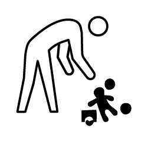 | Recoger los juguetes o herramientas |  | Recoger los objetos fuera de lugar |
|  | Recoger los platos sucios |  | Regar las plantas |  | Reponer el papel higiénico |
| 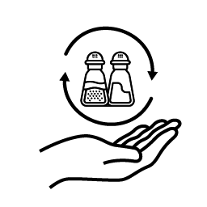 | Reponer los elementos necesarios sal pimienta etc |  | Reponer los suministros necesarios ej post-it |  | Revisar la agenda y hacer planes |
| 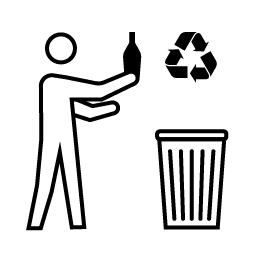 | Revisar y desechar productos viejos | 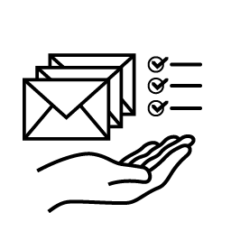 | Revisar y ordenar el correo |  | Revisar y organizar los estantes |
|  | Revisar y reparar las luces exteriores |  | Sacar la basura |  | Tomar medicamentos |
|  | Tomar una taza de té o café |  | Ventilar el área |  | Ventilar la habitación |
|  | Ver televisión |
